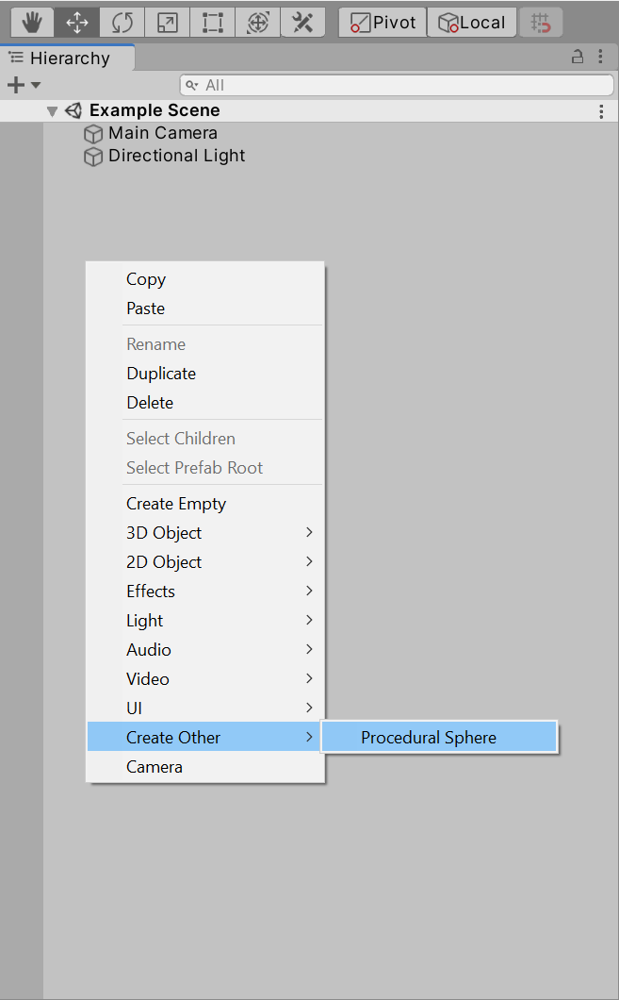

# Procedural-Sphere
**Procedural Sphere** with customizable layered noise calculated in **Compute Shaders**.

### Summary:
 - **"Animatable"** noise offset with a **Constant Velocity** or with an **Object's Position**.
 - Noise processing done on GPU with Compute Shaders.
 - Highly customizable noise.
 - **Cube Sphere** with **Uniform Geometry** as a base mesh for linear resolution manipulation.
 - **Gradient** mapped **to VertexColors** based on height.
 - **Smooth and Sharp** noise processing.
 - **GPU Instancing** option.
 

Adding template sphere from GameObject menu:

 ## How to install a package from github URL
https://docs.unity3d.com/Manual/upm-ui-giturl.html